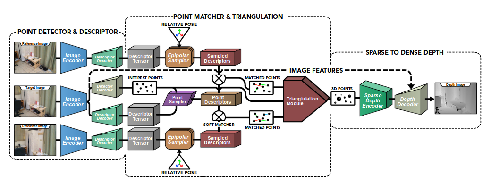
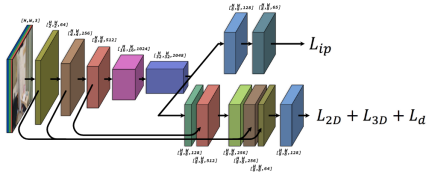
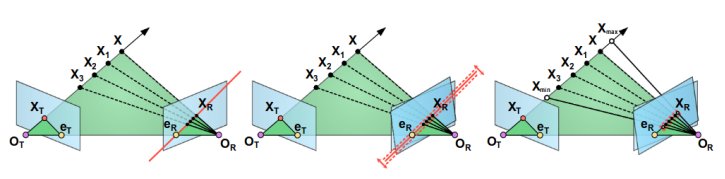
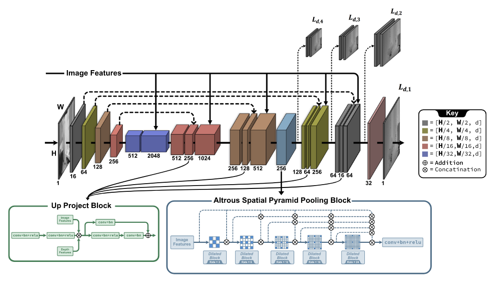

# SLAM-course-project
## Experiment

### Triangulation measurement

- Conseption: Infer the distance of the interested point from the observed position.

  - Epipolar geometry: 
    $$
    s_2x_2=s_1Rx_1+t
    $$
    
  - Depth estimation under geometry constraint:
    $$
    s_2x_2^{\land}x_2=0=s_1x_2^{\land}Rx_1+x_2^{\land}t
    $$
  
- Error estimation:

  - Mean Absolute Error (MAE)
  - Root Mean Squared Error (RMSE)
  - Logarithmic Root Mean Squared Error (RMSE Log)

    ```python
    for i, match in enumerate(matches):
        u, v = keypoints1[match.queryIdx].pt
        u, v = int(u), int(v)
        if u < 0 or v < 0 or u >= depth_img.shape[1] or v >= depth_img.shape[0]:
            continue
        depth = depth_img[v, u] / 5000.0  # Assuming depth is in millimeters and scale factor is 5000
        if depth <= 0:
            continue
    
        X, Y, Z = triangulated_points[i]
        Z_est = Z
    
        error = abs(depth - Z_est)
        errors.append(error)
    
    errors = np.array(errors)
    mae = np.mean(errors)
    rmse = np.sqrt(np.mean(errors ** 2))
    rmse_log = np.sqrt(np.mean(np.log(1 + error) ** 2))
    ```

    

- Feature point detection algorithm:

  - ORB: Non-maximum suppression direction moment
  - SIFT: Extreme point detection and calculate the gradient direction
  - SURF: Determinant detection of feature points to calculate Haar response
  
    ```python
    if method == "ORB":
        feature_detector = cv2.ORB_create()
        norm_type = cv2.NORM_HAMMING
    elif method == "SIFT":
        feature_detector = cv2.xfeatures2d.SIFT_create()
        norm_type = cv2.NORM_L2
    elif method == "SURF":
        feature_detector = cv2.xfeatures2d.SURF_create()
        norm_type = cv2.NORM_L2
    else:
        raise ValueError("Unsupported feature detection method")
    ```

Because the calculation of feature descriptors is different between each method, the distance metric is also different.

We adjust the empirical value of screening matching point pairs on the basis of twice the minimum distance to control the number of point pairs obtained by these methods in the same range.

```python
if method == "ORB":
    good_matches = [m for m in matches if m.distance <= max(2 * min_dist, 50.0)]
elif method == "SURF":
    good_matches = [m for m in matches if m.distance <= max(2 * min_dist, 0.15)]
else:  # sift
    good_matches = [m for m in matches if m.distance <= max(2 * min_dist, 100)]
```

### Deltas

> Sinha, A., Murez, Z., Bartolozzi, J., Badrinarayanan, V., & Rabinovich, A. (2020). DELTAS: Depth Estimation by Learning Triangulation And densification of Sparse points. In ECCV. Retrieved from https://arxiv.org/abs/2003.08933



Fig. 1. End-to-end network for detection and description of interest points, matching and triangulation of the points and densification of 3D points for depth estimation.


- Feature point extraction and descriptor calculation:
  - SuperPoint is used to extract feature points and calculate descriptor of target image 
    
  
    
  
    Fig. 2. SuperPoint-like network with detector and descriptor heads.
  
- Feature point matching and triangulation:
  - Sample descriptors according to the relation of polar geometry
    
  
    
    Fig 2. Search by epipolar sampling.
  - Triangulate the feature points by SVD singular value decomposition method
- Densify the sparse depth map:
  - The encode(Resnet 50 based)-decode schema generates the final dense depth map
  
    
    Fig 5. Proposed sparse-to-dense network architecture.
  
  - The space pyramid pool module is used to obtain the characteristics of different receptive fields

## Environment

### C++ environment construction

The c++ code can only work in opencv with the `vision>=4.2`, version 4.2.0 is encouraged because of the support of `SIFT` and `SURF` detect method. You can construct the opencv referring to the command below:

```bash
# download OpenCV source code
git clone https://github.com/opencv/opencv.git
cd opencv
git checkout 4.9.0

# download opencv_contrib source code
cd ..
git clone https://github.com/opencv/opencv_contrib.git
cd opencv_contrib
git checkout 4.9.0

# build opencv with contribute mode
cd ../opencv
mkdir build
cd build

# cmake constructino
cmake -DOPENCV_EXTRA_MODULES_PATH=../../opencv_contrib/modules -DOPENCV_ENABLE_NONFREE=ON ..
make -j$(nproc)
sudo make install

# check if opencv has been installed successfully
pkg-config --modversion opencv4

# if you encountered problem in cmake build operation of ninja
sudo apt install ninja-build
```

> references:
>
> https://blog.csdn.net/Gordon_Wei/article/details/88920411
>
> https://blog.csdn.net/AiXiangSiyou/article/details/121629190

### Python environment construction

The python code also need the avaliability of `SIFT` and `SURF` detect method, so `opencv-python` is needed with the `version<=3.4`, you can just use the command

```bash
# python 3.8
pip install opencv-python==3.4.8.29
pip install opencv-contrib-python==3.4.8.29
pip install torch==2.3.0 torchvision==0.18.0 torchaudio==2.3.0 --index-url https://download.pytorch.org/whl/cu118
pip install numpy matplotlib Path
```

or using conda environment export file `deltas.yaml`:

```bash
conda env create -f deltas.yaml
```

## Dataset

this project used `Portland_hotel` and `tum` dataset:

### Download links:

> tum fr1/xyz dataset:
>
> https://cvg.cit.tum.de/rgbd/dataset/freiburg1/rgbd_dataset_freiburg1_xyz.tgz
>
> Portland_hotel dataset:
>
> https://sun3d.cs.princeton.edu/data/Portland_hotel/

### Dataset format:

tum dataset:

```
rgbd_dataset_freiburg1_xyz
├── accelerometer.txt
├── associate.txt  # offcial tools generated
├── depth
│   ├── 1305031102.160407.png
│   ├── ...
│   └── 1305031128.754646.png
├── depth.txt
├── groundtruth.txt
├── rgb
│   ├── 1305031102.175304.png
│   ├── ...
│   └── 1305031128.747363.png
└── rgb.txt
```

Portland_hotel dataset:

```
Portland_hotel
├── depth
│   ├── 0000001-000000000000.png
│   ├── ...
│   └── 0013323-000446500440.png
├── extrinsics
│   └── 20140808220511.txt
├── image
│   ├── 0000001-000000000000.jpg
│   ├── ...
│   └── 0013323-000446500152.jpg
├── intrinsics.txt
└── thumbnail
    └── 20140808220511.jpg
```

## Run the code

### Triangulation part

c++ version: 

compile cmake project to execute `triangulation` binary file.

python version: 

```bash
python main.py
```

and you can get 3 `.csv` files to look through the result.

### Deltas part

> https://github.com/magicleap/DELTAS
>
> https://blog.csdn.net/qq_29462849/article/details/118586745

```bash
python test_learnabledepth.py
```

## Result

|          |  Avg MAE   |  Avg RMSE   | Avg RMSE log |
| :------: | :--------: | :---------: | :----------: |
|   ORB    |   58.997   |   364.173   |    2.092     |
|   SIFT   |   48.187   |   244.912   |    2.171     |
| **SURF** | **41.150** | **222.978** |  **2.073**   |

Table 1. Triangulation using 3 methods in `200` image-pairs with the interval of `120` frames.

|          | **Avg MAE** | **Avg RMSE** | **Avg RMSE log** |
| :------: | :---------: | :----------: | :--------------: |
|   ORB    |    8.044    |  **13.386**  |      1.925       |
|   SIFT   |    9.289    |    21.232    |      1.823       |
| **SURF** |  **7.453**  |    15.280    |    **1.746**     |

Table 2. Triangulation using 3 methods in `45` image-pairs with the interval of `120` frames.

|          |  AbR  |  SqR  | AbD/MAE | RMSE  | RMSE log |
| :------: | :---: | :---: | :-----: | :---: | :------: |
| 1 frame  | 0.802 | 3.408 |  4.209  | 4.349 |  1.647   |
| 2 frames | 0.802 | 3.390 |  4.199  | 4.325 |  1.643   |
| 4 frames | 0.803 | 3.378 |  4.192  | 4.312 |  1.639   |
| 5 frames | 0.803 | 3.381 |  4.194  | 4.313 |  1.642   |
| 7 frames | 0.803 | 3.379 |  4.193  | 4.311 |  1.640   |

Table 2. Performance of depth estimation (pretrained model) in tum dataset using sequences of length `3`.

## Reference

> [Inference Code for DELTAS: Depth Estimation by Learning Triangulation And densification of Sparse point (ECCV 2020)](https://github.com/magicleap/DELTAS)
>
> [DELTAS: Depth Estimation by Learning Triangulation And densification of Sparse points](https://arxiv.org/abs/2003.08933)